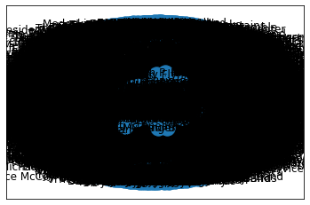
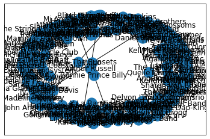
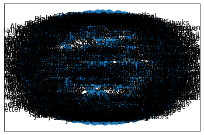
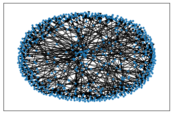
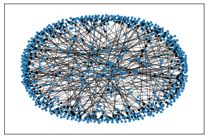

```python
import json

import networkx as nx
import pandas as pd
import numpy as np
# import matplotlib.pyplot as plt
```


```python
with open('../data/raw/followed_artists.json') as f:
    artists = json.load(f)
```


```python
artists_dict = {}
artists_dict['id'] = [i['id'] for i in artists]
artists_dict['artist'] = [i['name'] for i in artists]
artists_dict['followers'] = [i['followers']['total'] for i in artists]
artists_dict['popularity'] = [i['popularity'] for i in artists]
# artists_dict['image_url'] =  [i['images'][0]['url'] for i in artists]
artists_dict['related_artist'] = [i['related_artists'] for i in artists]
# artists_dict['related_id'] = [i['related_ids'] for i in artists]
```


```python
df = pd.DataFrame.from_dict(artists_dict)
```


```python
# "melt" name list into individual rows
# https://stackoverflow.com/questions/27263805/pandas-column-of-lists-create-a-row-for-each-list-element

lst_col = 'related_artist'

r = pd.DataFrame({
      col:np.repeat(df[col].values, df[lst_col].str.len())
      for col in df.columns.drop(lst_col)}
    ).assign(**{lst_col:np.concatenate(df[lst_col].values)})[df.columns]
```


```python
r.loc[r['related_artist'].str.contains('\$')]
```


<div>
<style scoped>
    .dataframe tbody tr th:only-of-type {
        vertical-align: middle;
    }

    .dataframe tbody tr th {
        vertical-align: top;
    }

    .dataframe thead th {
        text-align: right;
    }
</style>
<table border="1" class="dataframe">
  <thead>
    <tr style="text-align: right;">
      <th></th>
      <th>id</th>
      <th>artist</th>
      <th>followers</th>
      <th>popularity</th>
      <th>related_artist</th>
    </tr>
  </thead>
  <tbody>
    <tr>
      <th>1756</th>
      <td>2YZyLoL8N0Wb9xBt1NhZWg</td>
      <td>Kendrick Lamar</td>
      <td>16770291</td>
      <td>90</td>
      <td>A$AP Rocky</td>
    </tr>
    <tr>
      <th>1764</th>
      <td>2YZyLoL8N0Wb9xBt1NhZWg</td>
      <td>Kendrick Lamar</td>
      <td>16770291</td>
      <td>90</td>
      <td>Joey Bada$$</td>
    </tr>
  </tbody>
</table>
</div>


```python
# temp fix to remove special characters from name (Joey Bada$$ and A$AP Rocky were throwing errors)
r['artist'] = r['artist'].str.replace('$', 'S')
r['related_artist'] = r['related_artist'].str.replace('$', 'S')
```

    <ipython-input-20-5e25f823d8ee>:2: FutureWarning: The default value of regex will change from True to False in a future version. In addition, single character regular expressions will*not* be treated as literal strings when regex=True.
      r['artist'] = r['artist'].str.replace('$', 'S')
    <ipython-input-20-5e25f823d8ee>:3: FutureWarning: The default value of regex will change from True to False in a future version. In addition, single character regular expressions will*not* be treated as literal strings when regex=True.
      r['related_artist'] = r['related_artist'].str.replace('$', 'S')


```python
r.loc[r['related_artist'].str.contains('\$')]
```


<div>
<style scoped>
    .dataframe tbody tr th:only-of-type {
        vertical-align: middle;
    }

    .dataframe tbody tr th {
        vertical-align: top;
    }

    .dataframe thead th {
        text-align: right;
    }
</style>
<table border="1" class="dataframe">
  <thead>
    <tr style="text-align: right;">
      <th></th>
      <th>id</th>
      <th>artist</th>
      <th>followers</th>
      <th>popularity</th>
      <th>related_artist</th>
    </tr>
  </thead>
  <tbody>
  </tbody>
</table>
</div>


```python
G = nx.from_pandas_edgelist(r, 
                            source='artist',
                            target='related_artist',
                            edge_attr='followers',
                            create_using=nx.DiGraph())
```


```python
nx.draw_networkx(G)
```

    /Users/colinspear/.venv/music/lib/python3.9/site-packages/matplotlib/backends/backend_agg.py:238: RuntimeWarning: Glyph 41594 missing from current font.
      font.set_text(s, 0.0, flags=flags)
    /Users/colinspear/.venv/music/lib/python3.9/site-packages/matplotlib/backends/backend_agg.py:238: RuntimeWarning: Glyph 3901 missing from current font.
      font.set_text(s, 0.0, flags=flags)
    /Users/colinspear/.venv/music/lib/python3.9/site-packages/matplotlib/backends/backend_agg.py:238: RuntimeWarning: Glyph 2951 missing from current font.
      font.set_text(s, 0.0, flags=flags)
    /Users/colinspear/.venv/music/lib/python3.9/site-packages/matplotlib/backends/backend_agg.py:238: RuntimeWarning: Glyph 3968 missing from current font.
      font.set_text(s, 0.0, flags=flags)
    /Users/colinspear/.venv/music/lib/python3.9/site-packages/matplotlib/backends/backend_agg.py:238: RuntimeWarning: Glyph 3854 missing from current font.
      font.set_text(s, 0.0, flags=flags)
    /Users/colinspear/.venv/music/lib/python3.9/site-packages/matplotlib/backends/backend_agg.py:238: RuntimeWarning: Glyph 2531 missing from current font.
      font.set_text(s, 0.0, flags=flags)
    /Users/colinspear/.venv/music/lib/python3.9/site-packages/matplotlib/backends/backend_agg.py:238: RuntimeWarning: Glyph 2530 missing from current font.
      font.set_text(s, 0.0, flags=flags)
    /Users/colinspear/.venv/music/lib/python3.9/site-packages/matplotlib/backends/backend_agg.py:238: RuntimeWarning: Glyph 1566 missing from current font.
      font.set_text(s, 0.0, flags=flags)
    /Users/colinspear/.venv/music/lib/python3.9/site-packages/matplotlib/backends/backend_agg.py:238: RuntimeWarning: Glyph 1558 missing from current font.
      font.set_text(s, 0.0, flags=flags)
    /Users/colinspear/.venv/music/lib/python3.9/site-packages/matplotlib/backends/backend_agg.py:238: RuntimeWarning: Glyph 22823 missing from current font.
      font.set_text(s, 0.0, flags=flags)
    /Users/colinspear/.venv/music/lib/python3.9/site-packages/matplotlib/backends/backend_agg.py:238: RuntimeWarning: Glyph 21644 missing from current font.
      font.set_text(s, 0.0, flags=flags)
    /Users/colinspear/.venv/music/lib/python3.9/site-packages/matplotlib/backends/backend_agg.py:238: RuntimeWarning: Glyph 37027 missing from current font.
      font.set_text(s, 0.0, flags=flags)
    /Users/colinspear/.venv/music/lib/python3.9/site-packages/matplotlib/backends/backend_agg.py:238: RuntimeWarning: Glyph 21335 missing from current font.
      font.set_text(s, 0.0, flags=flags)
    /Users/colinspear/.venv/music/lib/python3.9/site-packages/matplotlib/backends/backend_agg.py:201: RuntimeWarning: Glyph 41594 missing from current font.
      font.set_text(s, 0, flags=flags)
    /Users/colinspear/.venv/music/lib/python3.9/site-packages/matplotlib/backends/backend_agg.py:201: RuntimeWarning: Glyph 3901 missing from current font.
      font.set_text(s, 0, flags=flags)
    /Users/colinspear/.venv/music/lib/python3.9/site-packages/matplotlib/backends/backend_agg.py:201: RuntimeWarning: Glyph 2951 missing from current font.
      font.set_text(s, 0, flags=flags)
    /Users/colinspear/.venv/music/lib/python3.9/site-packages/matplotlib/backends/backend_agg.py:201: RuntimeWarning: Glyph 3968 missing from current font.
      font.set_text(s, 0, flags=flags)
    /Users/colinspear/.venv/music/lib/python3.9/site-packages/matplotlib/backends/backend_agg.py:201: RuntimeWarning: Glyph 3854 missing from current font.
      font.set_text(s, 0, flags=flags)
    /Users/colinspear/.venv/music/lib/python3.9/site-packages/matplotlib/backends/backend_agg.py:201: RuntimeWarning: Glyph 2531 missing from current font.
      font.set_text(s, 0, flags=flags)
    /Users/colinspear/.venv/music/lib/python3.9/site-packages/matplotlib/backends/backend_agg.py:201: RuntimeWarning: Glyph 2530 missing from current font.
      font.set_text(s, 0, flags=flags)
    /Users/colinspear/.venv/music/lib/python3.9/site-packages/matplotlib/backends/backend_agg.py:201: RuntimeWarning: Glyph 1566 missing from current font.
      font.set_text(s, 0, flags=flags)
    /Users/colinspear/.venv/music/lib/python3.9/site-packages/matplotlib/backends/backend_agg.py:201: RuntimeWarning: Glyph 1558 missing from current font.
      font.set_text(s, 0, flags=flags)
    /Users/colinspear/.venv/music/lib/python3.9/site-packages/matplotlib/backends/backend_agg.py:201: RuntimeWarning: Glyph 22823 missing from current font.
      font.set_text(s, 0, flags=flags)
    /Users/colinspear/.venv/music/lib/python3.9/site-packages/matplotlib/backends/backend_agg.py:201: RuntimeWarning: Glyph 21644 missing from current font.
      font.set_text(s, 0, flags=flags)
    /Users/colinspear/.venv/music/lib/python3.9/site-packages/matplotlib/backends/backend_agg.py:201: RuntimeWarning: Glyph 37027 missing from current font.
      font.set_text(s, 0, flags=flags)
    /Users/colinspear/.venv/music/lib/python3.9/site-packages/matplotlib/backends/backend_agg.py:201: RuntimeWarning: Glyph 21335 missing from current font.
      font.set_text(s, 0, flags=flags)


    

    


```python
r_graph = r.sample(100)
G = nx.from_pandas_edgelist(r_graph, 
                            source='artist',
                            target='related_artist',
                            edge_attr='followers',
                            create_using=nx.DiGraph())
```


```python
nx.draw_networkx(G)
```


    

    


```python
r_graph = r.sample(500)
G = nx.from_pandas_edgelist(r_graph, 
                            source='artist',
                            target='related_artist',
                            edge_attr='followers',
                            create_using=nx.DiGraph())
```


```python
nx.draw_networkx(G)
```


    

    


```python
nx.draw_networkx(G, with_labels=False, node_size=10)
```


    

    


```python
nx.draw_networkx(G, with_labels=False, node_size=10, width=0.5)
```


    

    


```python

```
